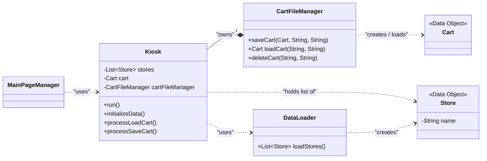
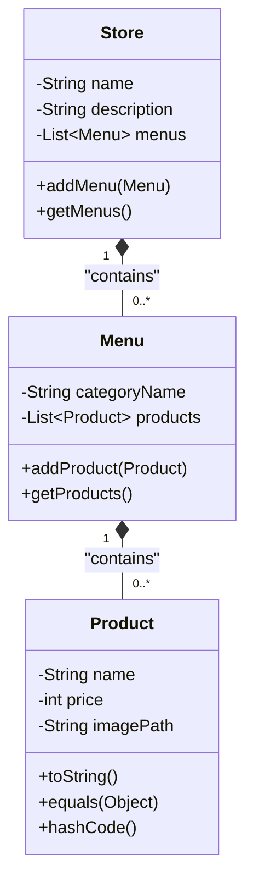
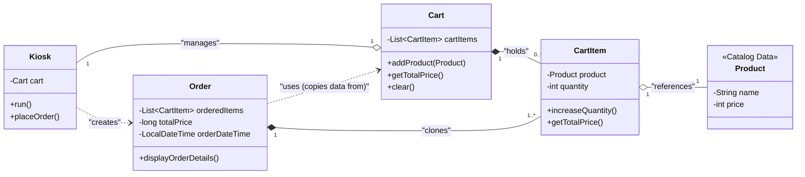

<h2>구조도</h2>

```mermaid
    classDiagram
    direction LR
    
    MainPageManager ..> Kiosk : "uses"
    
    class Kiosk {
        -List~Store~ stores
        -Cart cart
        -CartFileManager cartFileManager
        +run()
        +initializeData()
        +processLoadCart()
        +processSaveCart()
    }
    
    class DataLoader {
        +List~Store~ loadStores()
    }
    
    class CartFileManager {
        +saveCart(Cart, String, String)
        +Cart loadCart(String, String)
        +deleteCart(String, String)
    }

    class Store {
        <<Data Object>>
        -String name
    }
    
    class Cart {
         <<Data Object>>
    }

    Kiosk --* "1" CartFileManager : "owns"
    Kiosk ..> DataLoader : "uses"
    Kiosk ..> Store : "holds list of"
    
    DataLoader ..> Store : "creates"
    CartFileManager ..> Cart : "creates / loads"
```

```mermaid
    classDiagram
    direction TD

    class Store {
        -String name
        -String description
        -List~Menu~ menus
        +addMenu(Menu)
        +getMenus()
    }
    
    class Menu {
        -String categoryName
        -List~Product~ products
        +addProduct(Product)
        +getProducts()
    }
    
    class Product {
        -String name
        -int price
        -String imagePath
        +toString()
        +equals(Object)
        +hashCode()
    }
    
    Store "1" *-- "0..*" Menu : "contains"
    Menu "1" *-- "0..*" Product : "contains"
```

```mermaid
    classDiagram
    direction LR

    class Kiosk {
        -Cart cart
        +run()
        +placeOrder()
    }
    
    class Cart {
        -List~CartItem~ cartItems
        +addProduct(Product)
        +getTotalPrice()
        +clear()
    }
    
    class CartItem {
        -Product product
        -int quantity
        +increaseQuantity()
        +getTotalPrice()
    }
    
    class Product {
        <<Catalog Data>>
        -String name
        -int price
    }
    
    class Order {
        -List~CartItem~ orderedItems
        -long totalPrice
        -LocalDateTime orderDateTime
        +displayOrderDetails()
    }
    
    Kiosk "1" --o "1" Cart : "manages"
    Cart "1" *-- "0..*" CartItem : "holds"
    CartItem "1" o-- "1" Product : "references"
    
    Kiosk ..> Order : "creates"
    Order ..> Cart : "uses (copies data from)"
    Order "1" *-- "1..*" CartItem : "clones"
```